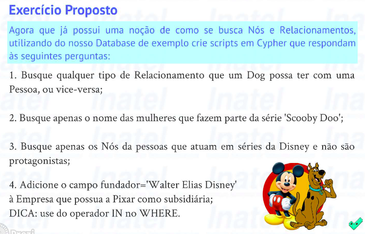

## **Search on Neo4J Database**

<div align="center">
    </img>
</div>

### **Question 1**
```javascript
MATCH (p:Person)-[r]->(d:Dog) RETURN type(r)
```

### **Question 2**
```javascript
MATCH (p:Person)-[f:FAZ_PARTE]->(s:Serie) WHERE s.nome='Scooby Doo' AND p.sexo='F' RETURN p.nome AS nome
```

### **Question 3**
```javascript
MATCH (p:Person)-[f:FAZ_PARTE]->(s:Serie)-[:PERTENCE]->(c:Company) WHERE c.nome='Walt Disney' AND f.protagonista=false RETURN p
```

### **Question 4**
```javascript
MATCH (c:Company) WHERE 'Pixar' IN c.subsidiarias SET c.fundador='Walter Elias Disney'
```